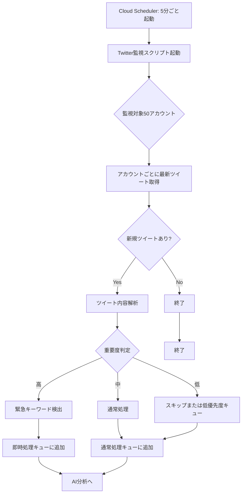
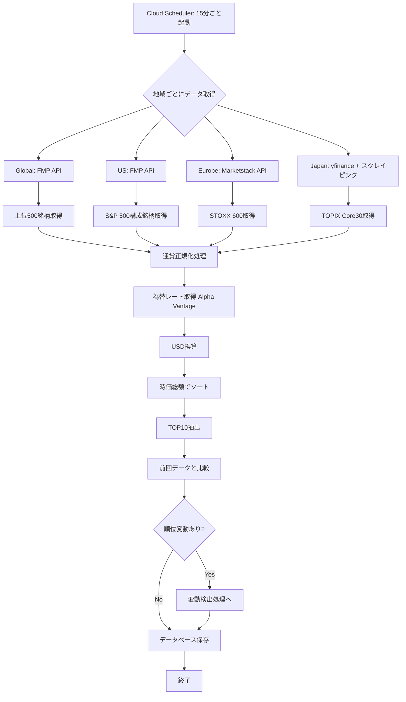
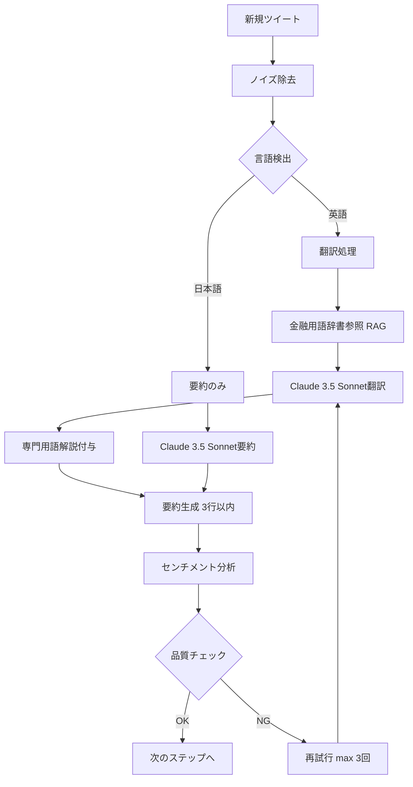
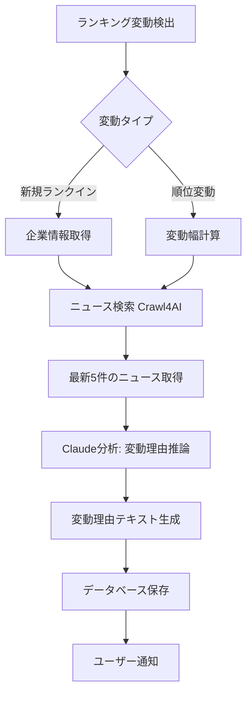
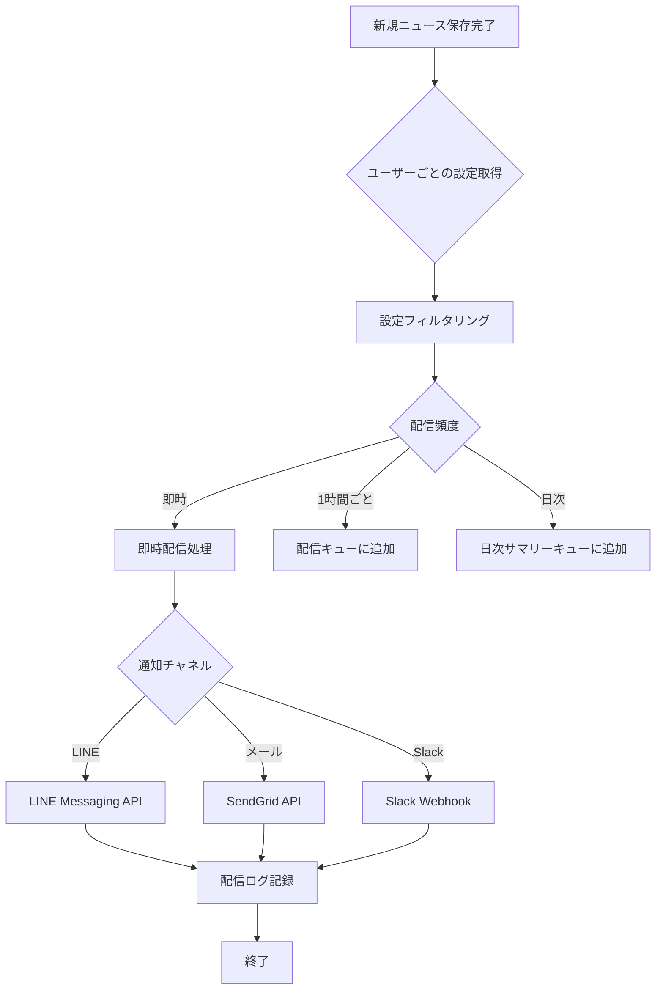
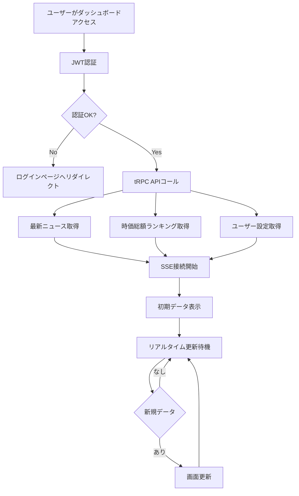
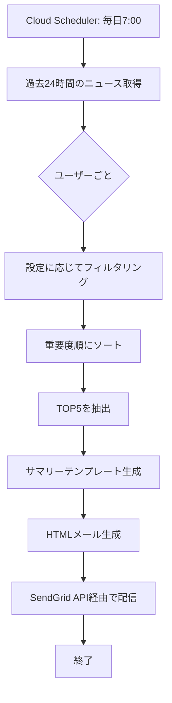
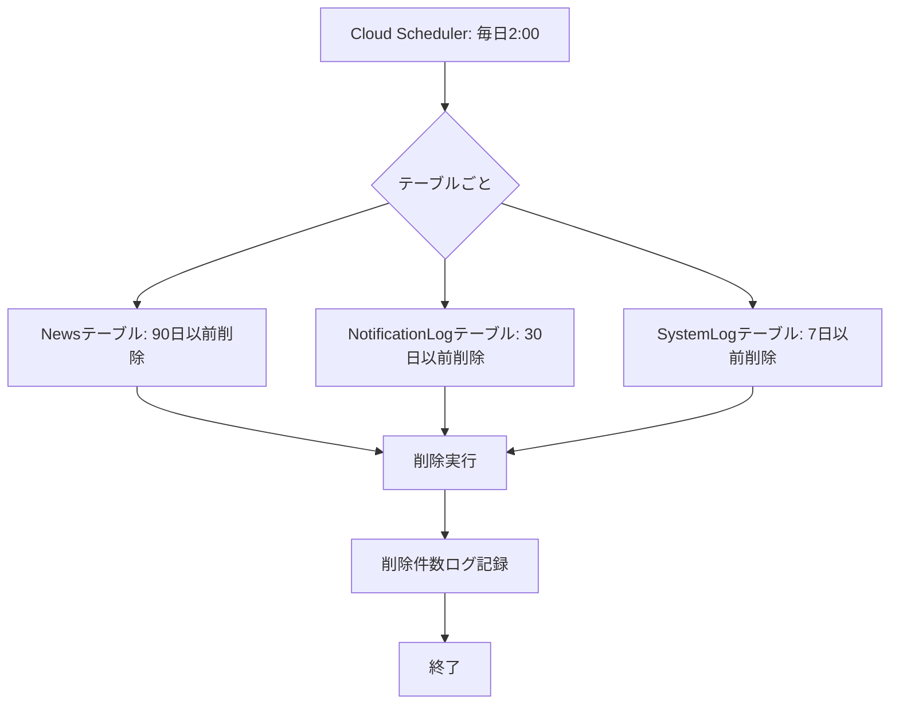
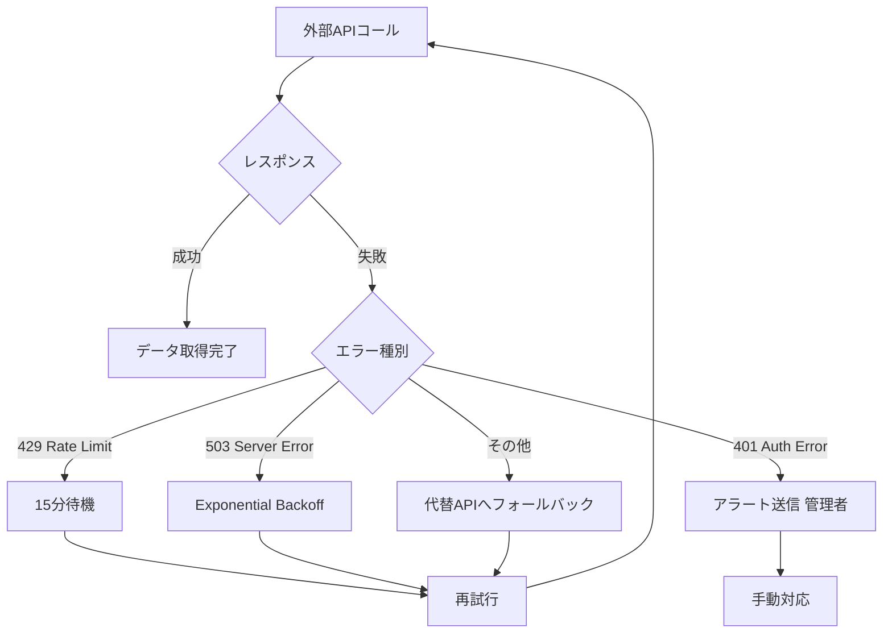
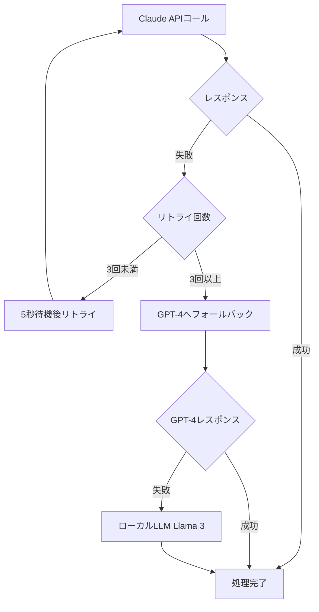

# ワークフロー
## 女性起業家向け金融インテリジェンス配信システム

**作成日**: 2026年1月5日
**バージョン**: 1.0
**プロジェクトコード**: FIN-INTEL-001

---

## 目次

1. [システム全体フロー](#1-システム全体フロー)
2. [データ収集ワークフロー](#2-データ収集ワークフロー)
3. [AI分析ワークフロー](#3-ai分析ワークフロー)
4. [配信ワークフロー](#4-配信ワークフロー)
5. [ユーザーインタラクションフロー](#5-ユーザーインタラクションフロー)
6. [バッチ処理フロー](#6-バッチ処理フロー)
7. [エラーハンドリングフロー](#7-エラーハンドリングフロー)

---

## 1. システム全体フロー

### 1.1 アーキテクチャ概要図

```
┌───────────────────────────────────────────────────────────────┐
│                        外部データソース                         │
│  Twitter API │ FMP API │ Alpha Vantage │ スクレイピング対象    │
└────────┬──────┴─────┬────┴───────┬───────┴──────┬────────────┘
         │            │            │              │
         ▼            ▼            ▼              ▼
┌───────────────────────────────────────────────────────────────┐
│             Intelligence Engine (Python + Claude Code)         │
│  ┌──────────────────────────────────────────────────────────┐ │
│  │ Step 1: データ収集層                                      │ │
│  │ - Twitter監視 (5分間隔)                                   │ │
│  │ - 金融API呼び出し (15分間隔)                              │ │
│  │ - Webスクレイピング (必要時)                              │ │
│  └──────────────────────────────────────────────────────────┘ │
│         │                                                       │
│         ▼                                                       │
│  ┌──────────────────────────────────────────────────────────┐ │
│  │ Step 2: 前処理・フィルタリング                            │ │
│  │ - 重複除去                                                 │ │
│  │ - ノイズ除去（広告・スパム）                               │ │
│  │ - 重要度判定（優先度スコアリング）                         │ │
│  └──────────────────────────────────────────────────────────┘ │
│         │                                                       │
│         ▼                                                       │
│  ┌──────────────────────────────────────────────────────────┐ │
│  │ Step 3: AI分析層 (Claude Code + LangGraph)               │ │
│  │ - 翻訳・要約                                               │ │
│  │ - センチメント分析                                         │ │
│  │ - 関連銘柄抽出                                             │ │
│  │ - セクター判定                                             │ │
│  │ - 変動理由推論（ランキング変動時）                         │ │
│  └──────────────────────────────────────────────────────────┘ │
│         │                                                       │
│         ▼                                                       │
│  ┌──────────────────────────────────────────────────────────┐ │
│  │ Step 4: データ永続化                                      │ │
│  │ - PostgreSQLへ保存                                         │ │
│  │ - ベクターDB（RAG用）へ埋め込み保存                        │ │
│  └──────────────────────────────────────────────────────────┘ │
└────────┬──────────────────────────────────────────────────────┘
         │
         ▼
┌───────────────────────────────────────────────────────────────┐
│                    PostgreSQL (Cloud SQL)                      │
│   - ユーザーデータ                                             │
│   - ニュースデータ                                             │
│   - 時価総額ランキングデータ                                   │
└────────┬────────────────────────┬──────────────────────────────┘
         │                        │
         ▼                        ▼
┌─────────────────────┐    ┌──────────────────────────────────┐
│  配信エンジン        │    │  Next.js Frontend (Cloud Run)    │
│  (Python)           │    │  - ダッシュボードUI                │
│  - LINE配信          │    │  - リアルタイム更新 (SSE)          │
│  - メール配信        │    │  - ユーザー管理                    │
│  - Slack配信         │    └──────────────────────────────────┘
└─────────────────────┘
         │
         ▼
┌───────────────────────────────────────────────────────────────┐
│                        ユーザー                                 │
│       LINE │ メール │ ブラウザ │ スマホアプリ                   │
└───────────────────────────────────────────────────────────────┘
```

---

## 2. データ収集ワークフロー

### 2.1 Twitter監視フロー



#### 詳細ステップ

**Step 1: 監視起動**
- Cloud Schedulerが5分ごとにCloud Runのエンドポイントを呼び出し
- エンドポイント: `POST /api/internal/collect/twitter`

**Step 2: アカウントリスト取得**
```python
# 監視対象アカウントのリスト（config/twitter_accounts.yaml）
accounts = load_config("twitter_accounts.yaml")
# 例: ["@LizAnnSonders", "@elerianm", ...]
```

**Step 3: 並列取得**
```python
import asyncio
from tweepy import AsyncClient

async def fetch_tweets(accounts):
    client = AsyncClient(bearer_token=TWITTER_BEARER_TOKEN)
    tasks = [client.get_users_tweets(account, max_results=5) for account in accounts]
    results = await asyncio.gather(*tasks)
    return results
```

**Step 4: 新規判定**
- 前回取得時刻（Redisにキャッシュ）と比較
- 新規ツイートのみを次のステップへ

**Step 5: 重要度判定ロジック**
```python
def calculate_priority(tweet):
    score = 0

    # 緊急キーワード
    urgent_keywords = ["Breaking", "Alert", "Urgent", "FDA Approval"]
    if any(kw in tweet.text for kw in urgent_keywords):
        score += 100

    # ショートセラーアカウント
    short_seller_accounts = ["@HindenburgRes", "@muddywatersre"]
    if tweet.author in short_seller_accounts:
        score += 80

    # エンゲージメント
    if tweet.likes > 1000:
        score += 50
    if tweet.retweets > 500:
        score += 30

    # ティッカーシンボル含有
    if re.search(r'\$[A-Z]{1,5}', tweet.text):
        score += 20

    if score >= 100:
        return "high"
    elif score >= 50:
        return "medium"
    else:
        return "low"
```

---

### 2.2 時価総額データ収集フロー



#### 通貨正規化処理詳細

```python
async def normalize_to_usd(market_cap_local, currency):
    """
    現地通貨の時価総額をUSDに変換
    """
    if currency == "USD":
        return market_cap_local

    # 為替レート取得（Alpha Vantage）
    rate = await get_forex_rate(from_currency=currency, to_currency="USD")

    # 換算
    market_cap_usd = market_cap_local / rate

    return market_cap_usd

# 例
# 日本企業: 時価総額 50兆円 → USD換算
# rate = 150 (1 USD = 150 JPY)
# market_cap_usd = 50_000_000_000_000 / 150 = 333,333,333,333 USD
```

---

## 3. AI分析ワークフロー

### 3.1 翻訳・要約フロー（LangGraph）



#### LangGraphノード定義

```python
from langgraph.graph import StateGraph, END

# 状態定義
class TranslationState(TypedDict):
    original_text: str
    language: str
    translated_text: str
    summary: str
    sentiment: str
    retry_count: int

# グラフ構築
workflow = StateGraph(TranslationState)

# ノード追加
workflow.add_node("detect_language", detect_language_node)
workflow.add_node("translate", translate_node)
workflow.add_node("summarize", summarize_node)
workflow.add_node("analyze_sentiment", sentiment_node)
workflow.add_node("quality_check", quality_check_node)

# エッジ追加
workflow.add_edge("detect_language", "translate")
workflow.add_edge("translate", "summarize")
workflow.add_edge("summarize", "analyze_sentiment")
workflow.add_edge("analyze_sentiment", "quality_check")

# 条件分岐
workflow.add_conditional_edges(
    "quality_check",
    lambda state: "retry" if state["retry_count"] < 3 else "end",
    {
        "retry": "translate",
        "end": END
    }
)

# コンパイル
app = workflow.compile()
```

#### Claude プロンプト例

```python
TRANSLATION_PROMPT = """
あなたはウォール街で20年の経験を持つ日本人ファンドマネージャーです。
以下の英語の金融ツイートを、日本の個人投資家向けに翻訳してください。

要件:
1. 専門用語は日本語訳+カッコ書き原文（例: 「強気（Bullish）」）
2. スラングやミームも文脈に応じて解説
3. 数値は日本式（例: 10,000 → 1万）
4. 自然で読みやすい日本語

原文:
{original_text}

翻訳:
"""

SUMMARY_PROMPT = """
以下の翻訳済みテキストを、忙しい起業家向けに3行以内で要約してください。
- 最も重要なポイントのみ
- 専門用語は使わず、わかりやすく

翻訳文:
{translated_text}

要約:
"""

SENTIMENT_PROMPT = """
以下の金融ニュースのセンチメントを判定してください。

選択肢:
- positive: 株価上昇を示唆する内容
- negative: 株価下落・リスクを示唆
- neutral: 事実報道のみ

テキスト:
{text}

判定結果（positive/negative/neutralのみ）:
"""
```

---

### 3.2 変動理由推論フロー



#### 変動理由推論プロンプト

```python
RANKING_CHANGE_ANALYSIS_PROMPT = """
以下の企業の時価総額ランキングが変動しました。
最新のニュース記事から、変動理由を分析してください。

企業: {company_name} ({ticker})
変動: {old_rank}位 → {new_rank}位
時価総額変動: {change_percent}%

関連ニュース:
{news_articles}

分析要件:
1. 最も可能性の高い変動理由を1-2文で説明
2. 根拠となるニュースを引用
3. 投資家への影響を簡潔に記述

分析結果:
"""
```

---

## 4. 配信ワークフロー

### 4.1 プッシュ通知フロー



#### 配信判定ロジック

```python
async def should_notify_user(user_id, news_item):
    """
    ユーザー設定に基づき、通知すべきか判定
    """
    settings = await get_user_settings(user_id)

    # セクターフィルター
    if settings.preferred_sectors:
        if news_item.sector not in settings.preferred_sectors:
            return False

    # ミュートキーワード
    for keyword in settings.muted_keywords:
        if keyword.lower() in news_item.summary.lower():
            return False

    # ミュートアカウント
    if news_item.source in settings.muted_accounts:
        return False

    # 優先度フィルター（ユーザーが高優先度のみ受信設定の場合）
    if settings.priority_filter == "high" and news_item.priority != "high":
        return False

    return True
```

---

### 4.2 LINE Flex Message生成フロー

```python
def create_flex_message(news_item):
    """
    ニュースアイテムからFlex Messageを生成
    """
    # センチメントに応じた色設定
    color_map = {
        "positive": "#FF0000",  # 赤（強気）
        "negative": "#0000FF",  # 青（弱気）
        "neutral": "#808080",   # グレー
    }

    icon_map = {
        "positive": "🚀",
        "negative": "📉",
        "neutral": "➖",
    }

    flex_message = {
        "type": "flex",
        "altText": f"{icon_map[news_item.sentiment]} {news_item.summary[:30]}",
        "contents": {
            "type": "bubble",
            "header": {
                "type": "box",
                "layout": "vertical",
                "contents": [
                    {
                        "type": "text",
                        "text": f"{icon_map[news_item.sentiment]} {news_item.sentiment.upper()}",
                        "color": color_map[news_item.sentiment],
                        "weight": "bold"
                    }
                ]
            },
            "body": {
                "type": "box",
                "layout": "vertical",
                "contents": [
                    {
                        "type": "text",
                        "text": news_item.summary,
                        "weight": "bold",
                        "size": "md",
                        "wrap": True
                    },
                    {
                        "type": "text",
                        "text": f"出典: {news_item.source}",
                        "size": "sm",
                        "color": "#999999",
                        "margin": "md"
                    },
                    {
                        "type": "text",
                        "text": f"セクター: {news_item.sector}",
                        "size": "sm",
                        "color": "#999999"
                    }
                ]
            },
            "footer": {
                "type": "box",
                "layout": "vertical",
                "contents": [
                    {
                        "type": "button",
                        "action": {
                            "type": "uri",
                            "label": "詳細を見る",
                            "uri": news_item.notion_url or news_item.original_url
                        },
                        "style": "primary"
                    }
                ]
            }
        }
    }

    return flex_message
```

---

## 5. ユーザーインタラクションフロー

### 5.1 ダッシュボード表示フロー



---

### 5.2 SSE (Server-Sent Events) 実装

#### サーバー側（Next.js API Route）

```typescript
// app/api/sse/news/route.ts
import { NextRequest } from 'next/server';

export async function GET(request: NextRequest) {
  const encoder = new TextEncoder();

  const stream = new ReadableStream({
    async start(controller) {
      // クライアントへの接続確立
      controller.enqueue(encoder.encode('data: {"type":"connected"}\n\n'));

      // Prismaの変更監視（Polling方式）
      const interval = setInterval(async () => {
        const latestNews = await prisma.news.findMany({
          where: {
            createdAt: {
              gte: new Date(Date.now() - 60000), // 直近1分
            },
          },
          orderBy: { createdAt: 'desc' },
          take: 1,
        });

        if (latestNews.length > 0) {
          const data = JSON.stringify({
            type: 'news',
            data: latestNews[0],
          });
          controller.enqueue(encoder.encode(`data: ${data}\n\n`));
        }
      }, 5000); // 5秒ごと

      // クライアント切断時のクリーンアップ
      request.signal.addEventListener('abort', () => {
        clearInterval(interval);
        controller.close();
      });
    },
  });

  return new Response(stream, {
    headers: {
      'Content-Type': 'text/event-stream',
      'Cache-Control': 'no-cache',
      'Connection': 'keep-alive',
    },
  });
}
```

#### クライアント側（React）

```typescript
// components/NewsStream.tsx
'use client';
import { useEffect, useState } from 'react';

export function NewsStream() {
  const [news, setNews] = useState<NewsItem[]>([]);

  useEffect(() => {
    const eventSource = new EventSource('/api/sse/news');

    eventSource.onmessage = (event) => {
      const data = JSON.parse(event.data);

      if (data.type === 'news') {
        setNews((prev) => [data.data, ...prev]);

        // トースト通知
        toast({
          title: "新着ニュース",
          description: data.data.summary,
        });
      }
    };

    eventSource.onerror = () => {
      console.error('SSE connection error');
      eventSource.close();
    };

    return () => {
      eventSource.close();
    };
  }, []);

  return (
    <div>
      {news.map((item) => (
        <NewsCard key={item.id} news={item} />
      ))}
    </div>
  );
}
```

---

## 6. バッチ処理フロー

### 6.1 日次サマリー生成フロー



#### サマリーテンプレート例

```python
DAILY_SUMMARY_TEMPLATE = """
おはようございます！{user_name}さん

昨日の重要ニュース TOP5

{news_list}

今日の時価総額ランキング変動:
{ranking_changes}

詳細はダッシュボードでご確認ください:
{dashboard_url}

---
このメールは自動配信です。設定変更: {settings_url}
"""
```

---

### 6.2 古いデータの削除フロー



```sql
-- 90日以前のニュース削除
DELETE FROM news
WHERE created_at < NOW() - INTERVAL '90 days';

-- 30日以前の通知ログ削除
DELETE FROM notification_logs
WHERE sent_at < NOW() - INTERVAL '30 days';

-- 7日以前のシステムログ削除
DELETE FROM system_logs
WHERE created_at < NOW() - INTERVAL '7 days';
```

---

## 7. エラーハンドリングフロー

### 7.1 外部API障害時のフォールバック



#### Exponential Backoff実装

```python
from tenacity import retry, stop_after_attempt, wait_exponential

@retry(
    stop=stop_after_attempt(3),
    wait=wait_exponential(multiplier=1, min=1, max=10)
)
async def fetch_with_retry(url):
    """
    リトライ付きHTTPリクエスト
    1秒 → 2秒 → 4秒 → 諦め
    """
    async with httpx.AsyncClient() as client:
        response = await client.get(url)
        response.raise_for_status()
        return response.json()
```

---

### 7.2 Claude API障害時のフォールバック



---

**作成日**: 2026年1月5日
**次回更新**: 実装中に詳細を追記
