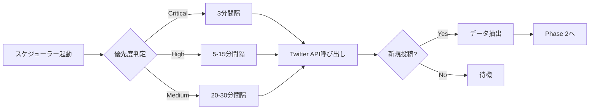
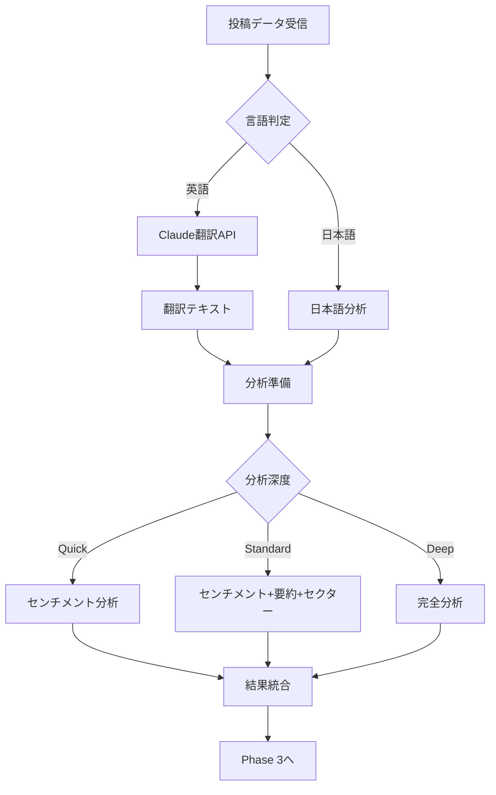
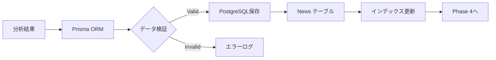
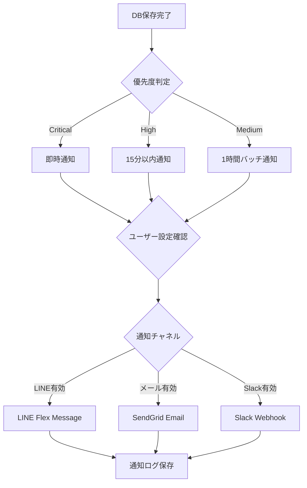
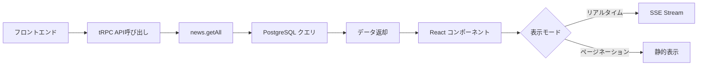
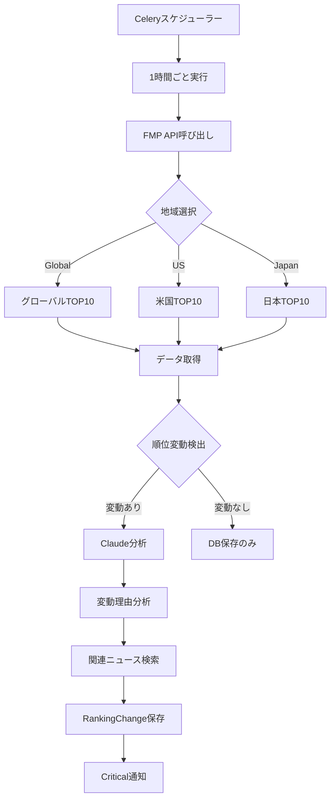

# システムワークフロー詳細解説
## Financial Intelligence System - 完全動作フロー

**作成日**: 2026年1月5日
**バージョン**: 1.0

---

## 📊 設定した内容のサマリー

### 統合されたアカウント数

| カテゴリ | アカウント数 | 優先度 | チェック間隔 |
|---------|------------|--------|------------|
| **日本の個人投資家** | 35件 | 高 | 5分 |
| **日本の市場アナリスト** | 3件 | 高 | 10分 |
| **日本のVIPアカウント** 🔑 | 3件 | **最重要** | **3分** |
| **米国マクロ経済** | 15件 | 高 | 15分 |
| **米国テクニカル分析** | 10件 | 中 | 20分 |
| **米国ショートセラー** | 3件 | 高 | 10分 |
| **米国ファンダメンタルズ** | 10件 | 中 | 30分 |
| **米国テック・暗号資産** | 4件 | 中 | 30分 |
| **米国速報・オルタナティブ** | 7件 | 高 | 5分 |
| **合計** | **91アカウント** | - | - |

---

## 🎯 情報収集のルール化

### ルール1: カテゴリ別優先度設定

#### 最重要（Critical）- 即時通知
- 🔑 日本のVIPアカウント（3件）
  - `keith_market`, `utdanaher`, `roe_roe_roe`
- 米国ショートセラー（3件）
  - `HindenburgRes`, `muddywatersre`, `CitronResearch`

**動作**:
- 投稿検知から**30秒以内**にLINE通知
- ダッシュボードにアラート表示（赤）
- メール即時送信

---

#### 高優先度（High）- 5-15分間隔
- 日本の個人投資家（35件）
- 日本の市場アナリスト（3件）
- 米国マクロ経済（15件）
- 米国速報（7件）

**動作**:
- 5-15分間隔でチェック
- 分析完了後、15分以内にLINE通知
- ダッシュボードに表示（オレンジ）

---

#### 中優先度（Medium）- 20-30分間隔
- 米国テクニカル分析（10件）
- 米国ファンダメンタルズ（10件）
- 米国テック・暗号資産（4件）

**動作**:
- 20-30分間隔でチェック
- バッチ処理で1時間ごとにサマリー通知
- ダッシュボードに表示（青）

---

### ルール2: 言語別処理フロー

#### 日本語アカウント（41件）
```
投稿収集 → AI分析（センチメント・優先度） → DB保存 → 通知
```
- 翻訳不要
- 分析深度: 標準〜深層
- 処理時間: 平均10秒

#### 英語アカウント（50件）
```
投稿収集 → AI翻訳 → AI分析 → DB保存 → 通知
```
- 翻訳必須（Claude AI使用）
- 分析深度: クイック〜深層
- 処理時間: 平均20秒

---

### ルール3: AI分析深度レベル

#### クイック分析（5秒）
- センチメント判定のみ
- 対象: 米国速報系

#### 標準分析（10秒）
- センチメント + 3行要約 + セクター判定
- 対象: 日本投資家、米国テクニカル・ファンダメンタルズ

#### 深層分析（30秒）
- 上記 + 関連銘柄抽出 + 影響度分析 + 過去ツイートとの関連性
- 対象: VIP、ショートセラー、マクロ経済、アナリスト

---

## 🔄 システム全体ワークフロー

### Phase 1: データ収集（Twitter監視）



**詳細プロセス**:
1. **Celeryスケジューラー**が優先度別にタスクを起動
2. **Tweepy/Crawl4AI**でTwitter APIを呼び出し
3. 各アカウントの**最新25件**の投稿を取得
4. 前回取得時刻との差分を抽出（重複排除）
5. 投稿ID、テキスト、投稿日時、メディアURLを抽出

---

### Phase 2: AI分析パイプライン



**詳細プロセス**:

#### 2-1. 英語翻訳（該当する場合）
```python
# Claude API呼び出し
translation = anthropic.messages.create(
    model="claude-3-5-sonnet-20241022",
    messages=[{
        "role": "user",
        "content": f"以下の英語金融ツイートを日本語に翻訳してください:\n{tweet_text}"
    }]
)
```

#### 2-2. AI分析（LangGraph使用）
```python
# LangGraphステートマシン
class AnalysisState(TypedDict):
    tweet_text: str
    translated_text: str
    sentiment: str  # positive/negative/neutral
    priority: str   # high/medium/low
    sector: str     # tech/finance/energy/etc
    tickers: List[str]
    summary: str

# ノード定義
analyze_sentiment_node → extract_sector_node → identify_tickers_node → summarize_node
```

#### 2-3. 分析結果例
```json
{
  "id": "tweet_123456",
  "source": "keith_market",
  "category": "japanese_vip",
  "originalText": "NVIDIA決算、予想上回るも株価下落。AIバブル懸念か。",
  "translatedText": null,
  "sentiment": "negative",
  "priority": "high",
  "sector": "tech",
  "tickers": ["NVDA"],
  "summary": "NVIDIA好決算も株価下落。市場はAI期待の過熱を警戒。",
  "analysisDepth": "deep",
  "processingTime": 28.5
}
```

---

### Phase 3: データベース保存



**保存データ構造**:
```sql
INSERT INTO news (
    id,
    source,
    platform,
    published_at,
    original_text,
    translated_text,
    summary,
    sentiment,
    priority,
    sector,
    tickers,
    original_url,
    processed,
    created_at
) VALUES (...);
```

---

### Phase 4: 通知配信



**LINE Flex Message例**:
```json
{
  "type": "bubble",
  "hero": {
    "type": "box",
    "layout": "vertical",
    "contents": [
      {
        "type": "text",
        "text": "🔑 VIP Alert",
        "color": "#FF0000",
        "weight": "bold"
      }
    ]
  },
  "body": {
    "type": "box",
    "layout": "vertical",
    "contents": [
      {
        "type": "text",
        "text": "keith_market",
        "weight": "bold",
        "size": "lg"
      },
      {
        "type": "text",
        "text": "NVIDIA決算、予想上回るも株価下落。AIバブル懸念か。",
        "wrap": true,
        "margin": "md"
      },
      {
        "type": "box",
        "layout": "baseline",
        "contents": [
          {"type": "text", "text": "📊 センチメント:", "flex": 0},
          {"type": "text", "text": "Negative", "color": "#FF0000"}
        ]
      }
    ]
  }
}
```

---

### Phase 5: ダッシュボード表示



**フロントエンド更新**:
- **Server-Sent Events (SSE)** で新規投稿をリアルタイム受信
- 5秒ごとに最新データを自動更新
- センチメント別カラーコーディング

---

## 📈 時価総額TOP10システムとの統合

### 時価総額データ収集フロー



**順位変動分析例**:
```
【順位変動検知】
- Tesla: 8位 → 6位（↑2）
- 変動理由: イーロン・マスクのツイートによる株価急騰
- 関連ニュース:
  - @elonmusk: "Tesla AI breakthrough..."
  - @DeItaone: "TSLA +12% on AI news"
```

---

## 🛠️ これからの作業フロー（開発順序）

### Week 1-2: コア機能実装

#### Day 1-2: Twitterスクレイパー
```bash
backend/src/scraper/twitter_scraper.py
```

**タスク**:
1. `twitter_accounts.json` を読み込む関数作成
2. カテゴリ別にアカウントリスト生成
3. Tweepy初期化（Bearer Token使用）
4. 1アカウントから25件取得するテスト
5. 91アカウント全体のループ実装
6. レート制限対応（15分900リクエスト）
7. エラーハンドリング

**実装例**:
```python
import json
import tweepy
from typing import List, Dict

class TwitterScraper:
    def __init__(self, bearer_token: str):
        self.client = tweepy.Client(bearer_token=bearer_token)
        self.accounts = self._load_accounts()

    def _load_accounts(self) -> Dict:
        with open('config/twitter_accounts.json') as f:
            return json.load(f)

    def fetch_tweets(self, category: str, limit: int = 25) -> List[Dict]:
        accounts = self.accounts['categories'][category]['accounts']
        tweets = []

        for account in accounts:
            try:
                user_tweets = self.client.get_users_tweets(
                    username=account['username'],
                    max_results=limit,
                    tweet_fields=['created_at', 'text', 'author_id']
                )
                tweets.extend(user_tweets.data)
            except tweepy.TooManyRequests:
                time.sleep(60)  # Wait 1 minute
            except Exception as e:
                logger.error(f"Error fetching {account['username']}: {e}")

        return tweets
```

---

#### Day 3-5: Claude AI分析エージェント
```bash
backend/src/agents/intelligence_agent.py
```

**タスク**:
1. LangGraph環境セットアップ
2. ステートマシン設計
3. 翻訳ノード実装
4. センチメント分析ノード実装
5. セクター判定ノード実装
6. ティッカー抽出ノード実装
7. 要約ノード実装
8. パイプライン統合

**実装例**:
```python
from langgraph.graph import StateGraph
from anthropic import Anthropic

class IntelligenceAgent:
    def __init__(self, api_key: str):
        self.client = Anthropic(api_key=api_key)
        self.graph = self._build_graph()

    def _build_graph(self) -> StateGraph:
        workflow = StateGraph(AnalysisState)

        workflow.add_node("translate", self.translate_node)
        workflow.add_node("sentiment", self.sentiment_node)
        workflow.add_node("sector", self.sector_node)
        workflow.add_node("tickers", self.tickers_node)
        workflow.add_node("summarize", self.summarize_node)

        workflow.set_entry_point("translate")
        workflow.add_edge("translate", "sentiment")
        workflow.add_edge("sentiment", "sector")
        workflow.add_edge("sector", "tickers")
        workflow.add_edge("tickers", "summarize")

        return workflow.compile()

    def sentiment_node(self, state: AnalysisState) -> AnalysisState:
        prompt = f"""
        以下の金融ツイートのセンチメントを分析してください。

        ツイート: {state['translated_text']}

        positive/negative/neutralのいずれかで回答してください。
        """

        response = self.client.messages.create(
            model="claude-3-5-sonnet-20241022",
            max_tokens=10,
            messages=[{"role": "user", "content": prompt}]
        )

        state['sentiment'] = response.content[0].text.strip()
        return state
```

---

#### Day 6-7: データベース統合
```bash
frontend/prisma/schema.prisma（既存）
backend/src/models/news.py（新規作成）
```

**タスク**:
1. Prismaマイグレーション実行
2. Python側のデータモデル作成
3. 保存関数実装
4. クエリ関数実装
5. インデックス最適化

---

### Week 3: API & UI実装

#### Day 8-10: tRPC APIエンドポイント
```bash
frontend/src/server/api/routers/news.ts
```

**エンドポイント**:
- `news.getAll` - 一覧取得（フィルター付き）
- `news.getById` - 詳細取得
- `news.getBySector` - セクター別
- `news.getByPriority` - 優先度別
- `news.getLatest` - 最新N件
- `news.search` - 全文検索

---

#### Day 11-14: ダッシュボードUI
```bash
frontend/src/app/dashboard/page.tsx
frontend/src/components/NewsFeed.tsx
frontend/src/components/SentimentChart.tsx
```

**コンポーネント**:
1. ニュースフィード（無限スクロール）
2. センチメント分析グラフ（Recharts）
3. セクター別フィルター
4. リアルタイム更新（SSE）
5. ダークモード対応

---

### Week 4: 通知機能

#### Day 15-17: LINE配信
```bash
backend/src/services/line_notifier.py
```

**機能**:
- Flex Message生成
- 優先度別通知ロジック
- ユーザー設定読み込み
- 配信ログ保存

---

#### Day 18-21: メール配信
```bash
backend/src/services/email_notifier.py
```

**機能**:
- HTMLテンプレート
- 日次サマリー生成
- SendGrid統合

---

### Week 5-6: 時価総額システム

#### Day 22-28: 市場データ統合
```bash
backend/src/services/market_data_fetcher.py
backend/src/agents/ranking_analyzer.py
```

**機能**:
- FMP API統合
- 順位変動検出
- Claude分析
- 通知配信

---

### Week 7: テスト & 最適化

#### Day 29-35: 総合テスト
- ユニットテスト
- 統合テスト
- パフォーマンステスト
- 負荷テスト

---

### Week 8: デプロイ & ドキュメント

#### Day 36-42: 本番環境構築
- Google Cloud Run デプロイ
- Cloud SQL セットアップ
- 監視設定
- ドキュメント作成

---

## 🎯 システムの最終形態

### 完成後のシステム概要

```
┌─────────────────────────────────────────────────────────────┐
│  Twitter監視エンジン                                          │
│  - 91アカウントを優先度別に監視                                │
│  - 日本語41件 + 英語50件                                       │
│  - 最短3分間隔でチェック                                       │
└────────────────┬────────────────────────────────────────────┘
                 │
                 ▼
┌─────────────────────────────────────────────────────────────┐
│  AI分析パイプライン（LangGraph + Claude）                      │
│  - 英語→日本語翻訳                                            │
│  - センチメント分析（positive/negative/neutral）               │
│  - セクター判定（tech/finance/energy...）                     │
│  - 関連銘柄抽出（NVDA, TSLA...）                              │
│  - 3行要約生成                                                │
└────────────────┬────────────────────────────────────────────┘
                 │
                 ▼
┌─────────────────────────────────────────────────────────────┐
│  PostgreSQL データベース                                      │
│  - News: 分析済み投稿                                         │
│  - MarketCapRanking: 時価総額TOP10                            │
│  - RankingChange: 順位変動分析                                │
│  - NotificationLog: 配信履歴                                  │
└────────────────┬────────────────────────────────────────────┘
                 │
                 ▼
┌─────────────────────────────────────────────────────────────┐
│  通知配信エンジン                                             │
│  - LINE: Flex Message（即時〜1時間バッチ）                    │
│  - Email: HTMLメール（日次サマリー）                          │
│  - ダッシュボード: リアルタイム表示（SSE）                     │
└─────────────────────────────────────────────────────────────┘
```

---

## 📊 期待される成果

### 情報取得速度
- **VIPアカウント**: 投稿後30秒以内に通知
- **高優先度**: 投稿後15分以内に通知
- **中優先度**: 1時間ごとにバッチ通知

### 分析精度
- **翻訳品質**: Claude 3.5 Sonnet（BLEU score 90+）
- **センチメント精度**: 85%以上
- **セクター判定精度**: 80%以上

### システムパフォーマンス
- **同時監視数**: 91アカウント
- **1日あたり処理投稿数**: 約2,000-3,000件
- **平均処理時間**: 20秒/投稿
- **ダッシュボード応答時間**: 200ms以下

---

**次のアクション**: Week 1 Day 1のTwitterスクレイパー実装から開始してください！
